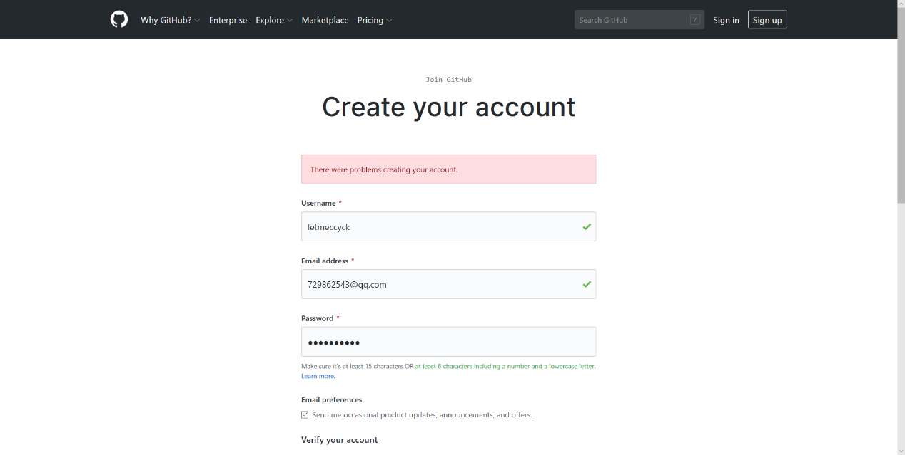
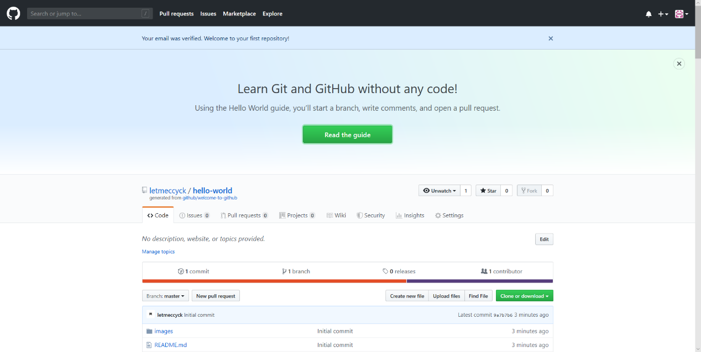
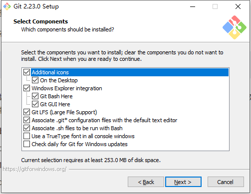
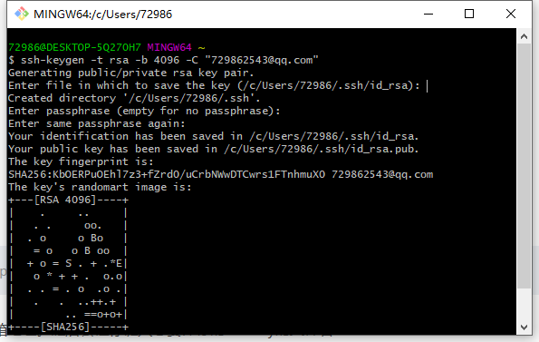
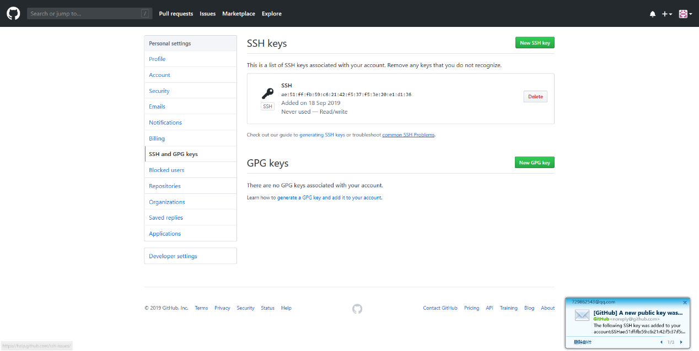
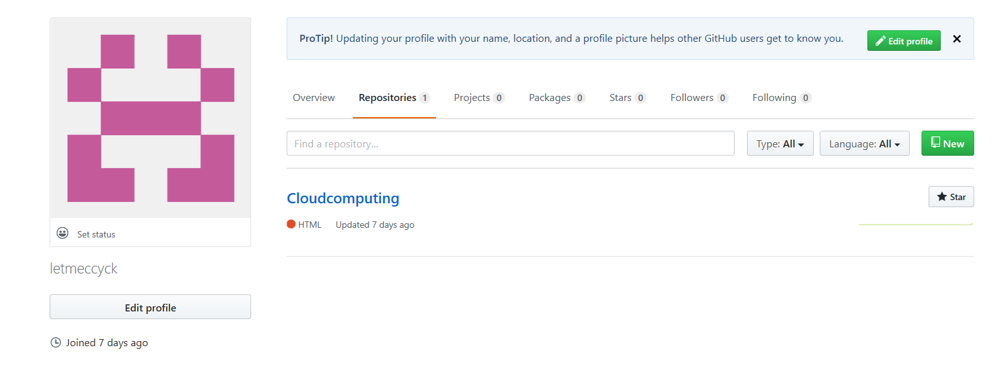
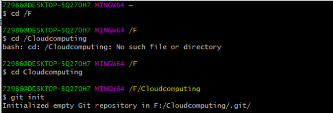
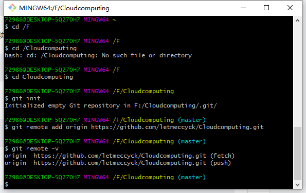

# 实验报告

## 实验一：Android开发基础

**一、实验内容**：

 

1.1安装Android Studio以及虚拟设备工具Genymotion

2.1 注册GitHub账号

2.2 在GitHub上创建项目（Android）并在本地同步

**二、实验步骤**

**1.1安装Android Studio以及虚拟设备工具Genymotion**

1.下载Android Studio后安装SDK，并通过百度云盘安装了Genymotion shell

**2.1 注册GitHub账号**

前往GitHub官网注册

 

**2.2 在GitHub上创建云计算项目（CloudComputing）并在本地同步**

（一）步骤一：安装Git

（二）步骤二：创建SSH Key

验证后发现不存在ssh keys，创建新的ssh key

查看“id_rsa”和“id_rsa.pub”两个文件

（三）步骤三：配置SSH Key

复制“id_rsa.pub”的内容到GitHub网站的Settings–>SSH and GPG keys中

测试SSH Key是否配置成功

（四）步骤四：配置GitHub的用户名和邮箱

（五）步骤五：创建GitHub项目并在本地进行同步

访问GitHub网站并新建代码仓库Android

创建本地代码仓库，并且拷贝GitHub网站中的项目网址

添加远程代码仓库的URL，并验证添加是否成功

新建README文档

添加文件夹中的所有文件

提交文件

推送本地更新至远程服务器

 