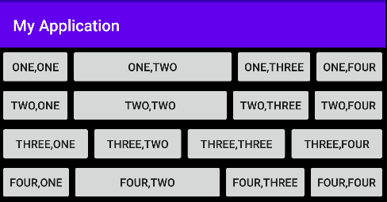
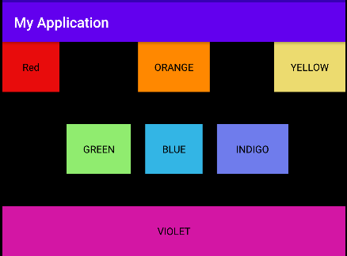
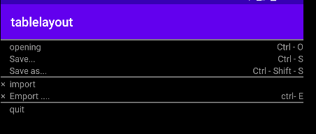

# 实验报告

## 实验二：Android布局实验

**一、实验内容**：

 1.线性布局实验

2.ConstraintLayout布局

3.表格布局实验

**二、实验步骤**

**1.线性布局实验**

1.1 activity_main.xml文件

```
<?xml version="1.0" encoding="utf-8"?>
<LinearLayout xmlns:android="http://schemas.android.com/apk/res/android"
    android:layout_width="match_parent"
    android:layout_height="match_parent"
    android:background="@color/colorBlack"
    android:orientation="vertical">
    <LinearLayout
        android:layout_width="match_parent"
        android:layout_height="wrap_content">
        <Button
            android:layout_width="wrap_content"
            android:layout_height="wrap_content"
            android:id="@+id/button1"
            android:text="@string/button11"/>
        <Button
            android:layout_width="wrap_content"
            android:layout_height="wrap_content"
            android:id="@+id/button2"
            android:layout_weight="1"
            android:text="@string/button12"/>
        <Button
            android:layout_width="wrap_content"
            android:layout_height="wrap_content"
            android:id="@+id/button3"
            android:text="@string/button13"/>

        <Button
            android:layout_width="wrap_content"
            android:layout_height="wrap_content"
            android:id="@+id/button4"
            android:text="@string/button14"/>
    </LinearLayout>
    <LinearLayout
        android:layout_width="match_parent"
        android:layout_height="wrap_content">
        <Button
            android:layout_width="wrap_content"
            android:layout_height="wrap_content"
            android:id="@+id/button11"
            android:text="@string/button21"/>

        <Button
            android:id="@id/button2"
            android:layout_width="wrap_content"
            android:layout_height="wrap_content"
            android:layout_weight="100"
            android:text="@string/button22" />

        <Button
            android:layout_width="wrap_content"
            android:layout_height="wrap_content"
            android:layout_weight="1"
            android:id="@id/button3"
            android:text="@string/button23" />

        <Button
            android:layout_width="wrap_content"
            android:layout_height="wrap_content"
            android:id="@id/button4"
            android:text="@string/button24"/>
    </LinearLayout>
    <LinearLayout
        android:layout_width="match_parent"
        android:layout_height="wrap_content">
        <Button
            android:layout_width="wrap_content"
            android:layout_height="wrap_content"
            android:layout_weight="1"
            android:id="@id/button1"
            android:text="@string/button31"/>
        <Button
            android:layout_width="wrap_content"
            android:layout_height="wrap_content"
            android:id="@id/button2"
            android:layout_weight="1"
            android:text="@string/button32"/>
        <Button
            android:layout_width="wrap_content"
            android:layout_height="wrap_content"
            android:layout_weight="1"
            android:id="@id/button3"
            android:text="@string/button33"/>

        <Button
            android:layout_width="wrap_content"
            android:layout_height="wrap_content"
            android:layout_weight="1"
            android:id="@id/button4"
            android:text="@string/button34"/>
    </LinearLayout>
    <LinearLayout
        android:layout_width="match_parent"
        android:layout_height="wrap_content">
        <Button
            android:layout_width="wrap_content"
            android:layout_height="wrap_content"
            android:id="@id/button1"
            android:text="@string/button41"/>
        <Button
            android:layout_width="wrap_content"
            android:layout_height="wrap_content"
            android:id="@id/button2"
            android:layout_weight="1"
            android:text="@string/button42"/>
        <Button
            android:layout_width="wrap_content"
            android:layout_height="wrap_content"
            android:id="@id/button3"
            android:text="@string/button43"/>

        <Button
            android:layout_width="wrap_content"
            android:layout_height="wrap_content"
            android:id="@id/button4"
            android:text="@string/button44"/>
    </LinearLayout>
</LinearLayout>
```

1.2 string.xml文件

```
<resources>
    <string name="app_name">My Application</string>
    <string name="to" />
    <string name="subject" />
    <string name="message" />
    <string name="button11" > ONE,ONE  </string>
    <string name="button12" > ONE,TWO  </string>
    <string name="button13" > ONE,THREE  </string>
    <string name="button14" > ONE,FOUR  </string>
    <string name="button21" > TWO, ONE  </string>
    <string name="button22" > TWO, TWO  </string>
    <string name="button23" > TWO, THREE  </string>
    <string name="button24" > TWO, FOUR </string>
    <string name="button31" > THREE, ONE  </string>
    <string name="button32" > THREE, TWO </string>
    <string name="button33" > THREE, THREE  </string>
    <string name="button34" > THREE, FOUR  </string>
    <string name="button41" > FOUR, ONE  </string>
    <string name="button42" > FOUR, TWO  </string>
    <string name="button43" > FOUR, THREE  </string>
    <string name="button44" > FOUR, FOUR  </string>
</resources>
```

1.3 color.xml文件


<?xml version="1.0" encoding="utf-8"?>

<color name="colorPrimary">#6200EE</color>
<color name="colorPrimaryDark">#3700B3</color>
<color name="colorAccent">#03DAC5</color>
<color name="colorBlack">#000000</color>
<color name="colorRed">#E80C0C</color>
<color name="colorYellow">#ECDB6F</color>
<color name="colorGreen">#90EC6F</color>
<color name="colorBlue">#6F7CEC</color>
<color name="colorViolet">#D316A4</color>
<color name="colorGray">#999999</color>
</resources>


1.4 运行结果



**2.ConstraintLayout布局**

2.1 activity_main.xml文件

```
<?xml version="1.0" encoding="utf-8"?>
<androidx.constraintlayout.widget.ConstraintLayout xmlns:android="http://schemas.android.com/apk/res/android"
    xmlns:app="http://schemas.android.com/apk/res-auto"
    xmlns:tools="http://schemas.android.com/tools"
    android:layout_width="match_parent"
    android:layout_height="300dp"
    android:background="@color/colorBlack">
    <TextView
        android:id="@+id/textView1"
        android:layout_width="80dp"
        android:layout_height="70dp"
        android:background="@color/colorRed"
        android:gravity="center"
        android:text="@string/red"
        android:textColor="@color/colorBlack"
        app:layout_constraintStart_toStartOf="parent"
        app:layout_constraintTop_toTopOf="parent" />

    <TextView
        android:id="@+id/textView2"
        android:layout_width="100dp"
        android:layout_height="70dp"
        android:background="@android:color/holo_orange_dark"
        android:gravity="center"
        android:text="@string/orange"
        android:textColor="@color/colorBlack"
        app:layout_constraintEnd_toEndOf="parent"
        app:layout_constraintStart_toStartOf="parent"
        app:layout_constraintTop_toTopOf="parent" />

    <TextView
        android:id="@+id/textView3"
        android:layout_width="100dp"
        android:layout_height="70dp"
        android:background="@color/colorYellow"
        android:gravity="center"
        android:text="@string/yellow"
        android:textColor="@color/colorBlack"
        app:layout_constraintEnd_toEndOf="parent"
        app:layout_constraintTop_toTopOf="parent" />

    <TextView
        android:layout_width="80dp"
        android:layout_height="70dp"
        android:id="@+id/textView4"
        android:text="@string/blue"
        android:textColor="@color/colorBlack"
        android:gravity="center"
        android:background="@android:color/holo_blue_light"
        app:layout_constraintTop_toTopOf="parent"
        app:layout_constraintEnd_toEndOf="parent"
        app:layout_constraintStart_toStartOf="parent"
        app:layout_constraintBottom_toBottomOf="parent"
        />
    <TextView
        android:layout_width="90dp"
        android:layout_height="70dp"
        android:id="@+id/textView5"
        android:text="@string/green"
        android:textColor="@color/colorBlack"
        android:gravity="center"
        android:background="@color/colorGreen"
        app:layout_constraintTop_toTopOf="parent"
        app:layout_constraintEnd_toStartOf="@id/textView4"
        android:layout_marginEnd="20dp"
        android:layout_marginStart="20dp"
        app:layout_constraintBottom_toBottomOf="parent"
        />
    <TextView
        android:layout_width="100dp"
        android:layout_height="70dp"
        android:id="@+id/textView6"
        android:text="@string/indigo"
        android:textColor="@color/colorBlack"
        android:gravity="center"
        android:background="@color/colorBlue"
        app:layout_constraintTop_toTopOf="parent"
        app:layout_constraintStart_toEndOf="@id/textView4"
        android:layout_marginEnd="20dp"
        android:layout_marginStart="20dp"
        app:layout_constraintBottom_toBottomOf="parent"/>

    <TextView
        android:layout_width="match_parent"
        android:layout_height="70dp"
        android:text="@string/violet"
        android:textColor="@color/colorBlack"
        android:background="@color/colorViolet"
        android:gravity="center"
        app:layout_constraintBottom_toBottomOf="parent"
        />
</androidx.constraintlayout.widget.ConstraintLayout>
```


2.2 string.xml文件

`<resources>`
    `<string name="app_name">My Application</string>`
    `<string name="to" />`
    `<string name="subject" />`
    `<string name="message" />`
    `<string name="red">Red</string>`
    `<string name="orange">ORANGE</string>`
    `<string name="yellow">YELLOW</string>`
    `<string name="blue">BLUE</string>`
    `<string name="green">GREEN</string>`
    `<string name="indigo">INDIGO</string>`
    `<string name="violet">VIOLET</string>`
`</resources>`


2.3 color.xml文件


`<resources>`
    `<color name="colorPrimary">#6200EE</color>`
    `<color name="colorPrimaryDark">#3700B3</color>`
    `<color name="colorAccent">#03DAC5</color>`
    `<color name="colorBlack">#000000</color>`
    `<color name="colorRed">#E80C0C</color>`
    `<color name="colorYellow">#ECDB6F</color>`
    `<color name="colorGreen">#90EC6F</color>`
    `<color name="colorBlue">#6F7CEC</color>`
    `<color name="colorViolet">#D316A4</color>`
    `<color name="colorGray">#999999</color>`
`</resources>`

2.4 运行结果




**3.表格布局实验**

3.1 activity_main.xml文件


```
<?xml version="1.0" encoding="utf-8"?>
<TableLayout xmlns:android="http://schemas.android.com/apk/res/android"
    xmlns:tools="http://schemas.android.com/tools"
    android:layout_width="match_parent" android:layout_height="match_parent"
    android:background="@android:color/background_dark"
    android:shrinkColumns="0"
    >
    <View android:id="@+id/top"
        android:layout_width="match_parent"
        android:layout_height="2dp"
        android:background="@color/colorGray"
        ></View>
    <TableRow>
        <TextView
            android:id="@+id/text"
            android:text="@string/blank"
            android:textColor="@color/colorGray" />
        <TextView
            android:id="@+id/text12"
            android:gravity="left"
            android:layout_weight="1"
            android:text="@string/open"
            android:textColor="@color/colorGray" />
        <TextView
            android:id="@+id/text13"
            android:gravity="right"
            android:layout_weight="1"
            android:text="@string/ctrl_o"
            android:textColor="@color/colorGray" />
    </TableRow>
    <TableRow>
        <TextView
            android:id="@id/text"
            android:text="@string/blank"
            android:textColor="@color/colorGray" />
        <TextView
            android:id="@+id/text22"
            android:gravity="left"
            android:layout_weight="1"
            android:text="@string/save"
            android:textColor="@color/colorGray" />

<TextView
    android:id="@+id/text"
    android:layout_weight="1"
    android:gravity="right"
    android:text="@string/ctrl_s"
    android:textColor="@color/colorGray"
    tools:ignore="DuplicateIds" />

</TableRow>
<TableRow>
    <TextView
        android:id="@id/text"
        android:text="@string/blank"
        android:textColor="@color/colorGray" />
    <TextView
        android:id="@+id/text32"
        android:gravity="left"
        android:layout_weight="1"
        android:text="@string/save_as"
        android:textColor="@color/colorGray" />

<TextView
    android:id="@id/text33"
    android:layout_weight="1"
    android:gravity="right"
    android:text="@string/ctrl_shift_s"
   android:textColor="@color/colorGray"
   />

</TableRow>

<View android:id="@+id/line"
    android:layout_width="match_parent"
    android:layout_height="2dp"
    android:background="@color/colorGray"
    ></View>

<TableRow>
    <TextView
        android:id="@id/text"
        android:text="@string/x"
        android:textColor="@color/colorGray" />
    <TextView
        android:id="@id/text41"
        android:layout_weight="1"
        android:text="@string/imports"
        android:textColor="@color/colorGray" />
</TableRow>
<TableRow>
    <TextView
        android:id="@id/text"
        android:text="@string/x"
        android:textColor="@color/colorGray" />
    <TextView
        android:id="@+id/text52"
        android:layout_weight="1"
        android:text="@string/emport"
        android:textColor="@color/colorGray" />

<TextView
    android:id="@+id/text53"
    android:layout_weight="1"
    android:gravity="right"
    android:text="@string/ctrl_e"
    android:textColor="@color/colorGray"
    />

</TableRow>
<View android:id="@id/line"
    android:layout_width="match_parent"
    android:layout_height="2dp"
    android:background="@color/colorGray"
    />
<TableRow>
    <TextView
        android:id="@id/text"
        android:text="@string/blank"
        android:textColor="@color/colorGray" />
    <TextView
        android:id="@+id/text6"
        android:layout_weight="1"
        android:text="@string/quit"
        android:textColor="@color/colorGray" />
</TableRow>
</TableLayout>
```


3.2 string.xml文件

```
<resources>
    <string name="app_name">tablelayout</string>
    <string name="ctrl_o">Ctrl - O</string>
    <string name="blank">" "</string>
    <string name="open">opening</string>
    <string name="save">Save...</string>
    <string name="ctrl_s">Ctrl - S</string>
    <string name="save_as">Save as...</string>
    <string name="ctrl_shift_s">Ctrl - Shift - S</string>
    <string name="x"> "×  "</string>
    <string name="imports" >import</string>
    <string name="emport">Emport ....</string>
    <string name="ctrl_e">ctrl- E</string>
    <string name="quit">quit</string>
</resources>
```


3.3 color.xml文件


`<?xml version="1.0" encoding="utf-8"?>`
`<resources><color name="colorPrimary">#6200EE</color>`
`<color name="colorPrimaryDark">#3700B3</color>`
`<color name="colorAccent">#03DAC5</color>`
`<color name="colorBlack">#000000</color>`
`<color name="colorRed">#E80C0C</color>`
`<color name="colorYellow">#ECDB6F</color>`
`<color name="colorGreen">#90EC6F</color>`
`<color name="colorBlue">#6F7CEC</color>`
`<color name="colorViolet">#D316A4</color>`
`<color name="colorGray">#999999</color></resources>`


3.4 运行结果

