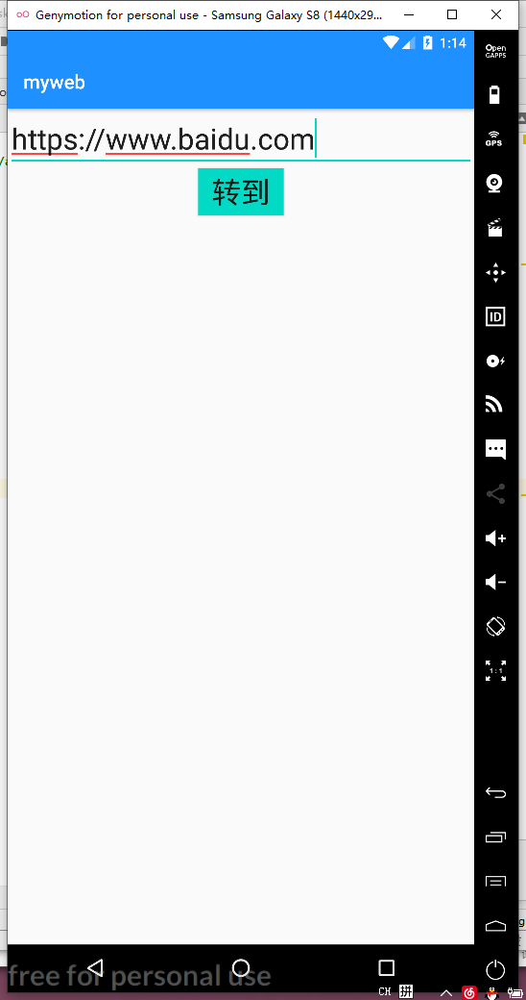
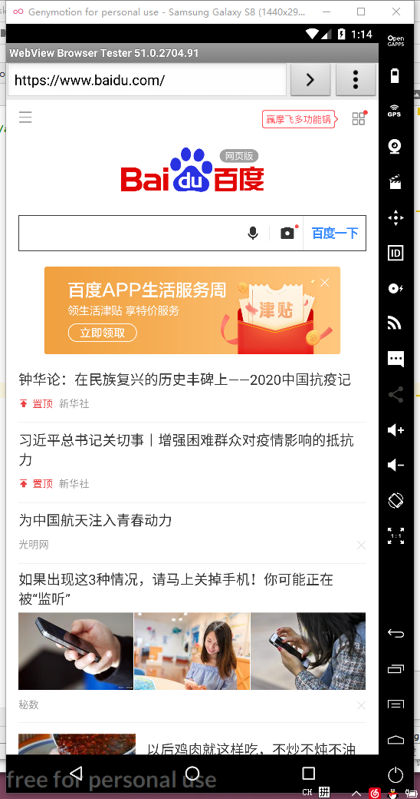
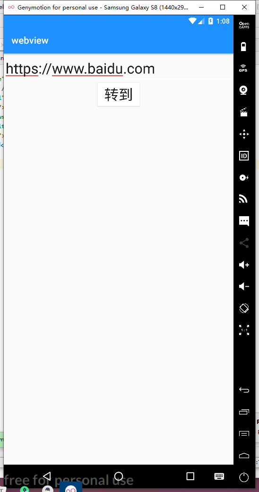
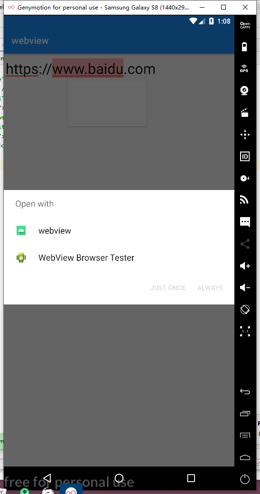

# 实验报告

## 实验四：intent

**一、实验内容**：

本实验通过自定义 WebViewWebView WebView 加载 URL 来验证隐式 Intent Inten用。
实验包含两个应用：
第一个应用：获取 URL 地址并启动隐式 Intent 的调用。
第二个应用：自定义 WebViewWebView WebView 来加载 URL

**二、实验步骤**

**1.新建一个工程获取URL并启动intent**

1.1 activity_main.xml文件

```
<?xml version="1.0" encoding="utf-8"?>
<LinearLayout xmlns:android="http://schemas.android.com/apk/res/android"
    android:orientation="vertical"
    android:layout_width="match_parent"
    android:layout_height="match_parent"
    android:gravity="center_horizontal">
    <EditText
        android:layout_width="match_parent"
        android:layout_height="wrap_content"
        android:id="@+id/urlinput"
        android:hint="@string/web_url"
        android:textSize="30sp"
        android:autofillHints="" />

    <Button
        android:id="@+id/button"
        android:layout_width="wrap_content"
        android:layout_height="wrap_content"
        android:text="转到"
        android:textSize="30sp"
        android:background="@color/colorAccent"
        android:layout_gravity="center"
        android:gravity="center" />
    <WebView
        android:layout_width="wrap_content"
        android:id="@+id/web"
        android:layout_height="wrap_content">
    </WebView>
</LinearLayout>
```

1. 2MainActivity.java文件

```
package com.example.myweb;

import androidx.appcompat.app.AppCompatActivity;

import android.os.Bundle;
import androidx.appcompat.app.AppCompatActivity;

import android.content.Intent;
import android.net.Uri;
import android.os.Bundle;
import android.view.View;
import android.webkit.WebView;
import android.webkit.WebViewClient;
import android.widget.Button;
import android.widget.EditText;

import java.net.URL;

public class MainActivity extends AppCompatActivity {
    EditText editText;
    Button button;
    @Override
    protected  void onCreate(Bundle savedInstanceState){
        super.onCreate(savedInstanceState);
        setContentView(R.layout.activity_main);
        button=findViewById(R.id.button);
        editText  =(EditText)findViewById(R.id.urlinput);
        button.setOnClickListener(new View.OnClickListener() {
            @Override
            public void onClick(View v) {
                Intent intent = new Intent();
                String uri="";
                uri=editText.getText().toString();
                intent.setData(Uri.parse(uri));
                intent.setAction(Intent.ACTION_VIEW);
                startActivity(intent);
            }
        });

        Intent intent=getIntent();
        Uri data = intent.getData();
        URL url=null;
        try{
            url=new URL(data.getScheme(),data.getHost(),data.getPath());
            startBroswer(url);
        }
        catch (Exception e){
            e.printStackTrace();
        }

    }
    private void startBroswer(URL url){
        WebView web=findViewById(R.id.web);
        web.loadUrl(url.toString());
        web.setWebViewClient(new WebViewClient(){
            @Override
            public boolean shouldOverrideUrlLoading(WebView v,String url){
                v.loadUrl(url);
                return true;
            }
        });
    }
}
```


1.3 运行结果





**2.使用webview加载url**

2.1 activity_main.xml文件

```
<?xml version="1.0" encoding="utf-8"?>
<LinearLayout xmlns:android="http://schemas.android.com/apk/res/android"
xmlns:tools="http://schemas.android.com/tools"
android:orientation="vertical"
android:layout_width="match_parent"
android:layout_height="match_parent"
android:gravity="center_horizontal">

    <EditText
        android:id="@+id/input"
        android:layout_width="match_parent"
        android:layout_height="wrap_content"
        android:autofillHints=""
        android:hint="@string/web_url"

        android:textSize="30sp"
        tools:ignore="TextFields" />

    <Button
        android:id="@+id/button"
        android:layout_width="wrap_content"
        android:layout_height="wrap_content"
        android:layout_gravity="center"
        android:background="@color/colorAccent"
        android:gravity="center"
        android:text="@string/go"

        android:textSize="30sp" />


</LinearLayout>
```


2.2 AndroidManifest.xml文件

```
<?xml version="1.0" encoding="utf-8"?>
<manifest xmlns:android="http://schemas.android.com/apk/res/android"
    package="com.example.webview">

    <application
        android:allowBackup="true"
        android:icon="@mipmap/ic_launcher"
        android:label="@string/app_name"
        android:roundIcon="@mipmap/ic_launcher_round"
        android:supportsRtl="true"
        android:theme="@style/AppTheme">
        <activity android:name=".MainActivity">
            <intent-filter>
                <action android:name="android.intent.action.MAIN" />
                <category android:name="android.intent.category.LAUNCHER" />
                <action android:name="android.intent.action.VIEW"/>
                <category android:name="android.intent.category.DEFAULT"/>
                <category android:name="android.intent.category.BROWSABLE"/>
                <data android:scheme="https"/>
            </intent-filter>
        </activity>
    </application>
</manifest>
```


2.3 MainActivity.java文件


```
package com.example.webview;
import androidx.appcompat.app.AppCompatActivity;
import android.content.Intent;
import android.net.Uri;
import android.os.Bundle;
import android.view.View;
import android.widget.Button;
import android.widget.EditText;

public class MainActivity extends AppCompatActivity {
    Button mButton;
    EditText mEditText;

    @Override
    protected void onCreate(Bundle savedInstanceState) {
        super.onCreate(savedInstanceState);
        setContentView(R.layout.activity_main);
        startBrowser();
    }

    boolean startBrowser() {
        mButton = findViewById(R.id.button);
        mEditText = findViewById(R.id.input);
        mButton.setOnClickListener(new View.OnClickListener() {
            @Override
            public void onClick(View v) {
                Intent intent = new Intent();
                intent.setAction(Intent.ACTION_VIEW);
                String url = "https://" + mEditText.getText().toString(); //加上协议
                intent.setData(Uri.parse(url));
                startActivity(intent);
            }
        });
        return true;
    }
}
```

2. 5运行结果






