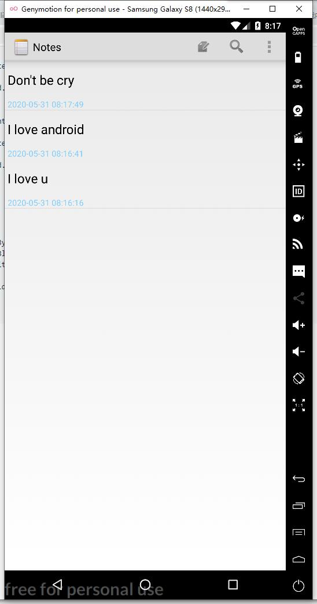
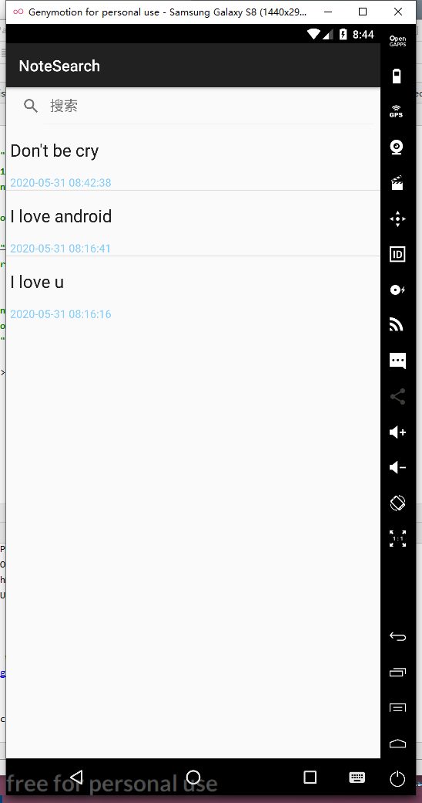

# 实验报告

## 实验五：notepad

**一、实验内容**：

1.NoteList中显示条目增加时间戳显示
2.添加笔记查询功能(根据标题查询)

**二、实验步骤**

**1.NoteList中显示条目增加时间戳显示核心代码**

1.1 增加时间戳显示：

```
<?xml version="1.0" encoding="utf-8"?>
<!-- Copyright (C) 2010 The Android Open Source Project

     Licensed under the Apache License, Version 2.0 (the "License");
     you may not use this file except in compliance with the License.
     You may obtain a copy of the License at
  
          http://www.apache.org/licenses/LICENSE-2.0
  
     Unless required by applicable law or agreed to in writing, software
     distributed under the License is distributed on an "AS IS" BASIS,
     WITHOUT WARRANTIES OR CONDITIONS OF ANY KIND, either express or implied.
     See the License for the specific language governing permissions and
     limitations under the License.
-->
<!--添加一个垂直的线性布局-->
<LinearLayout  xmlns:android="http://schemas.android.com/apk/res/android"
    android:id="@+id/layout"
    android:layout_width="match_parent"
    android:layout_height="match_parent"
    android:orientation="vertical">
    <!--原标题TextView-->
    <TextView xmlns:android="http://schemas.android.com/apk/res/android"
        android:id="@android:id/text1"
        android:layout_width="match_parent"
        android:layout_height="?android:attr/listPreferredItemHeight"
        android:textAppearance="?android:attr/textAppearanceLarge"
        android:gravity="center_vertical"
        android:paddingLeft="5dip"
        android:singleLine="true"
        />
    <!--添加显示时间的textview-->
    <TextView
        android:id="@+id/text_time"
        android:layout_width="match_parent"
        android:layout_height="wrap_content"
        android:textAppearance="?android:attr/textAppearanceSmall"
        android:paddingLeft="5dip"
</LinearLayout>
```

1. 2NotePadProvider.java文件

```
 @Override
    public Uri insert(Uri uri, ContentValues initialValues) {
        // Validates the incoming URI. Only the full provider URI is allowed for inserts.
        if (sUriMatcher.match(uri) != NOTES) {
            throw new IllegalArgumentException("Unknown URI " + uri);
        }

        // A map to hold the new record's values.
        ContentValues values;

        // If the incoming values map is not null, uses it for the new values.
        if (initialValues != null) {
            values = new ContentValues(initialValues);

        } else {
            // Otherwise, create a new value map
            values = new ContentValues();
        }
        // Gets the current system time in milliseconds（核心代码）
        Long now = Long.valueOf(System.currentTimeMillis());
        Date date = new Date(now); //获取时间
        SimpleDateFormat format = new SimpleDateFormat("yyyy-MM-dd HH:mm:ss");//设置日期格式
        String dateTime = format.format(date);  //为获取当前系统时间
        // If the values map doesn't contain the creation date, sets the value to the current time.
        if (values.containsKey(NotePad.Notes.COLUMN_NAME_CREATE_DATE) == false) {
            values.put(NotePad.Notes.COLUMN_NAME_CREATE_DATE, dateTime);
        }

        // If the values map doesn't contain the modification date, sets the value to the current
        // time.
        if (values.containsKey(NotePad.Notes.COLUMN_NAME_MODIFICATION_DATE) == false) {
            values.put(NotePad.Notes.COLUMN_NAME_MODIFICATION_DATE, dateTime);
        }

        // If the values map doesn't contain a title, sets the value to the default title.
        if (values.containsKey(NotePad.Notes.COLUMN_NAME_TITLE) == false) {
            Resources r = Resources.getSystem();
            values.put(NotePad.Notes.COLUMN_NAME_TITLE, r.getString(android.R.string.untitled));
        }

        // If the values map doesn't contain note text, sets the value to an empty string.
        if (values.containsKey(NotePad.Notes.COLUMN_NAME_NOTE) == false) {
            values.put(NotePad.Notes.COLUMN_NAME_NOTE, "");
        }

        // 新建笔记，背景默认为白色
        //if (values.containsKey(NotePad.Notes.COLUMN_NAME_BACK_COLOR) == false) {
         //   values.put(NotePad.Notes.COLUMN_NAME_BACK_COLOR, NotePad.Notes.DEFAULT_COLOR);
       // }
        // Opens the database object in "write" mode.
        SQLiteDatabase db = mOpenHelper.getWritableDatabase();

        // Performs the insert and returns the ID of the new note.
        long rowId = db.insert(
                NotePad.Notes.TABLE_NAME,        // The table to insert into.
                NotePad.Notes.COLUMN_NAME_NOTE,  // A hack, SQLite sets this column value to null
                // if values is empty.
                values                           // A map of column names, and the values to insert
                // into the columns.
        );
        // If the insert succeeded, the row ID exists.
        if (rowId > 0) {
            // Creates a URI with the note ID pattern and the new row ID appended to it.
            Uri noteUri = ContentUris.withAppendedId(NotePad.Notes.CONTENT_ID_URI_BASE, rowId);

            // Notifies observers registered against this provider that the data changed.
            getContext().getContentResolver().notifyChange(noteUri, null);
            return noteUri;
        }

        // If the insert didn't succeed, then the rowID is <= 0. Throws an exception.
        throw new SQLException("Failed to insert row into " + uri);
    }
```


1.3 运行结果



**2.添加笔记查询功能(根据标题查询)**

2.1 **NoteSearch.java**

```
package com.example.notepad;

import android.app.ListActivity;
import android.content.ContentUris;
import android.content.Intent;
import android.database.Cursor;
import android.net.Uri;
import android.os.Bundle;
import android.view.View;
import android.widget.ListView;
import android.widget.SearchView;
import android.widget.SimpleCursorAdapter;

/**
 * Created by c7 on 2019/5/15.
 */
public class NoteSearch  extends ListActivity  implements SearchView.OnQueryTextListener{
    private static final String[] PROJECTION = new String[]{
            NotePad.Notes._ID, // 0
            NotePad.Notes.COLUMN_NAME_TITLE, // 1        NotePad.Notes.COLUMN_NAME_MODIFICATION_DATE,//在这里加入了修改时间的显示
    };
    
    @Override
    protected void onCreate(Bundle savedInstanceState) {

        super.onCreate(savedInstanceState);
        setContentView(R.layout.note_search);
        Intent intent = getIntent();
        if (intent.getData() == null) {            intent.setData(NotePad.Notes.CONTENT_URI);
        }        getListView().setOnCreateContextMenuListener(this);
        //为查询文本框注册监听器
        SearchView mSearchView = (SearchView)findViewById(R.id.search_view);//注册监听器
        mSearchView.setIconifiedByDefault(false); //显示搜索的天幕，默认只有一个放大镜图标
        mSearchView.setSubmitButtonEnabled(true); //显示搜索按钮        mSearchView.setBackgroundColor(getResources().getColor(R.color.colorPrimary)); //设置背景颜色
        mSearchView.setOnQueryTextListener(this);
    }
    
    @Override
    public boolean onQueryTextSubmit(String s) {
        return false;
    }
    
    @Override
    public boolean onQueryTextChange(String s) { //Test改变的时候执行的内容
        //Text发生改变时执行的内容
        String selection = NotePad.Notes.COLUMN_NAME_TITLE + " Like ? ";//查询条件
        String[] selectionArgs = { "%"+s+"%" };//查询条件参数，配合selection参数使用,%通配多个字符
        //查询数据库中的内容,当我们使用 SQLiteDatabase.query()方法时，就会得到Cursor对象， Cursor所指向的就是每一条数据。

        //managedQuery(Uri, String[], String, String[], String)等同于Context.getContentResolver().query()
        Cursor cursor = managedQuery(
                getIntent().getData(),            // Use the default content URI for the provider.用于ContentProvider查询的URI，从这个URI获取数据
                PROJECTION,                       // Return the note ID and title for each note. and modifcation date.用于标识uri中有哪些columns需要包含在返回的Cursor对象中

                selection,                        // 作为查询的过滤参数，也就是过滤出符合selection的数据，类似于SQL的Where语句之后的条件选择

                selectionArgs,                    // 查询条件参数，配合selection参数使用

                NotePad.Notes.DEFAULT_SORT_ORDER  // Use the default sort order.查询结果的排序方式，按照某个columns来排序，例：String sortOrder = NotePad.Notes.COLUMN_NAME_TITLE

        );
        //一个简单的适配器，将游标中的数据映射到布局文件中的TextView控件或者ImageView控件中

        String[] dataColumns = { NotePad.Notes.COLUMN_NAME_TITLE ,  NotePad.Notes.COLUMN_NAME_MODIFICATION_DATE };
        int[] viewIDs = { android.R.id.text1 , R.id.text2 };
        SimpleCursorAdapter adapter = new SimpleCursorAdapter(
                this,                   //context:上下文
                R.layout.noteslist_item,         //layout:布局文件，至少有int[]的所有视图
                cursor,                          //cursor：游标
                dataColumns,                     //from：绑定到视图的数据
                viewIDs                          //to:用来展示from数组中数据的视图
                //flags：用来确定适配器行为的标志，Android3.0之后淘汰
        );
        setListAdapter(adapter);
        return true;
    }
}
```


2.2 note_search.xml文件

```
<?xml version="1.0" encoding="utf-8"?>
<LinearLayout xmlns:android="http://schemas.android.com/apk/res/android"
    android:orientation="vertical"
    android:layout_width="match_parent"
    android:layout_height="match_parent">

    <SearchView
        android:id="@+id/search_view"
        android:layout_width="match_parent"
        android:layout_height="wrap_content"
        android:iconifiedByDefault="false"
        android:queryHint="搜索"
        android:layout_alignParentTop="true">
    </SearchView>
    <ListView
        android:id="@android:id/list"
        android:layout_width="match_parent"
        android:layout_height="wrap_content">
    </ListView>
</LinearLayout>
```

2. 3运行结果




